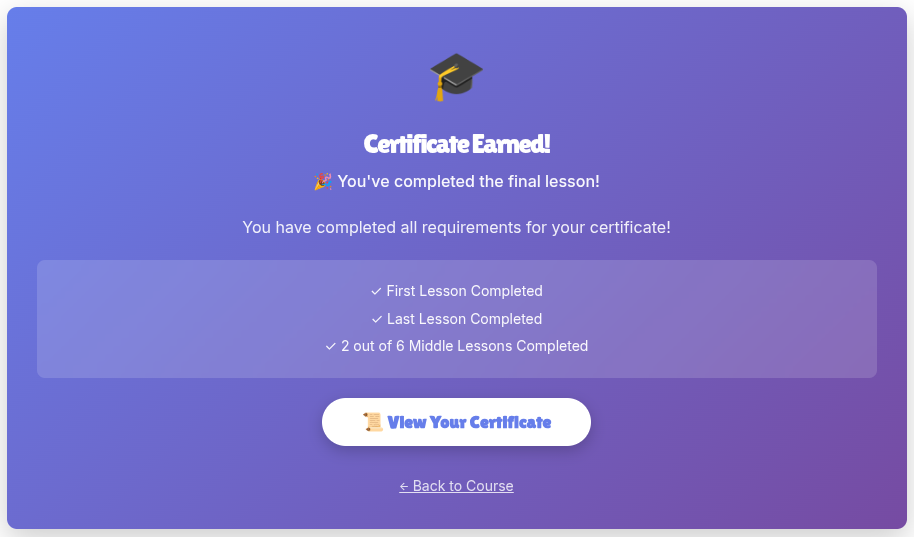
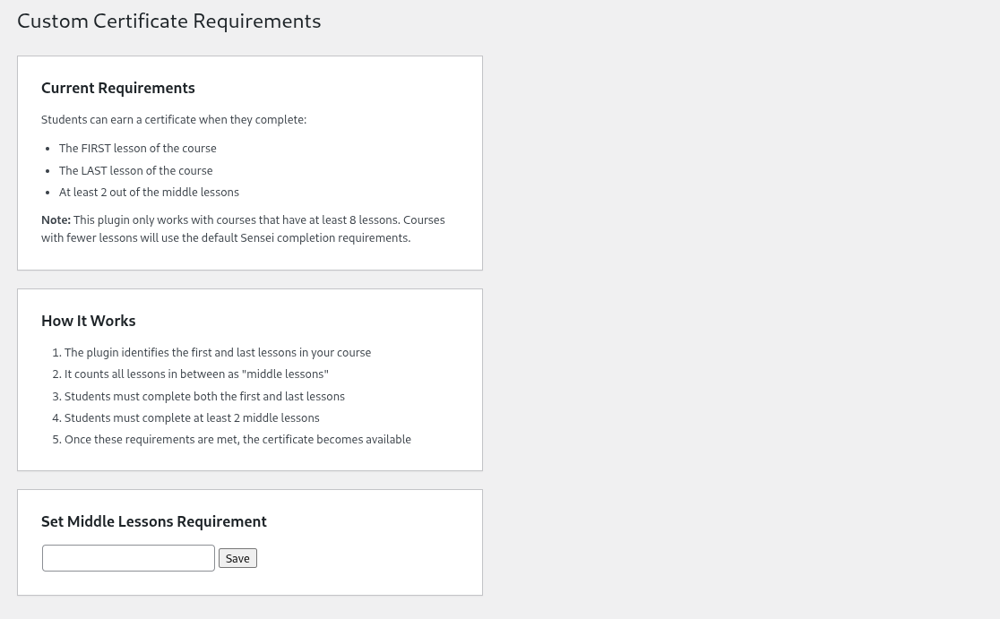
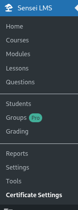

# EarlyCertify

Is a plugin which enables you to choose how many cources 
the user has to complete in order to recieve a certificate

Sets mandatory as first, last and how many you want from the middle

## Requirements:
Sensei LMS
Sensei LMS Certificates add-on

It adds a get certificate button that will only be displayed in the last lesson and after the course is considered completed

It creates a Sensei LMS sub menu to change settings

And is located Here

